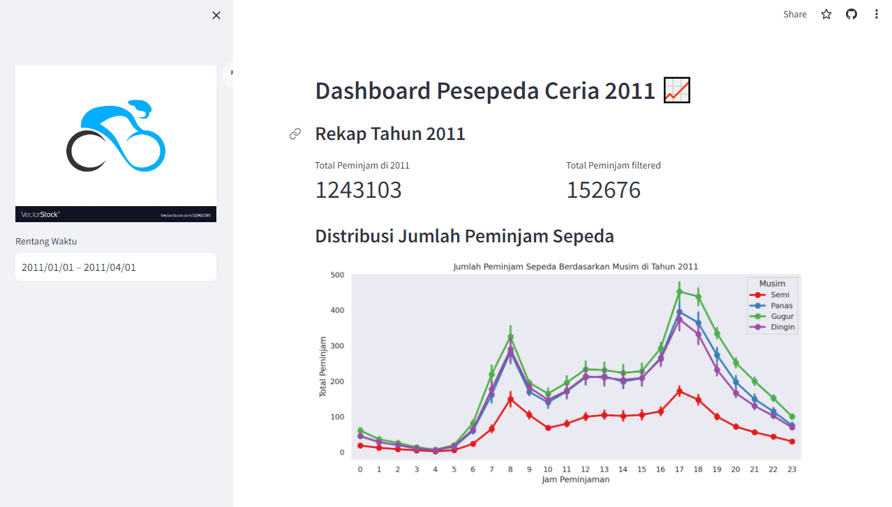

# Pesepeda Ceria Dashboard ✨

## Setup environment
```
conda create --name main-ds python=3.9
conda activate main-ds
pip install numpy pandas matplotlib seaborn streamlit babel
```

## Run Streamlit app
```
streamlit run dashboard.py
```

## Online Dasboard web
See online dashboard web below

[**Pesepeda Santai Dashboard**](https://dashboard-pesepeda-santai.streamlit.app/)


